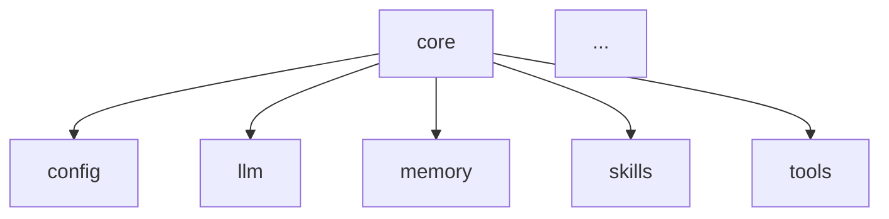

# 任务执行清单

## 状态说明
- [ ] 待执行
- [~] 执行中
- [x] 已完成
- [!] 阻塞/需要讨论

---

## Phase 0: 准备工作

### Task 0.1: 创建测试基线脚本
- [ ] 创建 `tests/baseline/` 目录
- [ ] 创建 `tests/baseline/test_imports_baseline.py`
- [ ] 测试所有核心模块的导入
- [ ] 记录结果到 `tests/baseline/results.txt`

**测试用例**:
```python
# 应该成功导入
from openakita.core import Agent, AgentState, TaskState, TaskStatus, Brain, Identity, RalphLoop
from openakita.core.tool_executor import ToolExecutor
from openakita.core.tool_filter import get_tools_for_message
from openakita.core.token_tracking import TokenTrackingContext
from openakita.core.skill_manager import SkillManager
from openakita.core.memory import Memory
from openakita.core.brain import Brain, Context
from openakita.llm import LLMClient
from openakita.tools import ShellTool, FileTool
from openakita.skills import SkillRegistry
from openakita.memory import MemoryManager
```

---

### Task 0.2: 创建依赖图分析脚本
- [ ] 创建 `scripts/analyze_dependencies.py`
- [ ] 分析 `core` 模块的依赖
- [ ] 生成依赖图（Mermaid 格式）
- [ ] 输出到 `docs/dependency_graph.md`

**输出示例**:


---

### Task 0.3: 建立功能测试基线
- [ ] 检查现有测试目录结构
- [ ] 运行 `pytest src/openakita/testing/ -v --tb=short`
- [ ] 记录通过/失败数量
- [ ] 保存结果到 `tests/baseline/pytest_results.txt`

---

## Phase 1: 基础设施层分离 (token_tracking)

### Task 1.1: 创建 infra 模块结构
- [ ] 创建 `src/openakita/infra/` 目录
- [ ] 创建 `src/openakita/infra/__init__.py`

```python
# src/openakita/infra/__init__.py
"""
OpenAkita 基础设施模块

提供跨模块共享的基础设施组件：
- Token 追踪
- 日志配置
- 指标收集
"""

from .token_tracking import (
    TokenTrackingContext,
    init_token_tracking,
    record_usage,
    reset_tracking_context,
    set_tracking_context,
    get_tracking_context,
)

__all__ = [
    "TokenTrackingContext",
    "init_token_tracking",
    "record_usage",
    "reset_tracking_context",
    "set_tracking_context",
    "get_tracking_context",
]
```

---

### Task 1.2: 移动 token_tracking.py
- [ ] 复制 `core/token_tracking.py` 到 `infra/token_tracking.py`
- [ ] 确认文件内容完整
- [ ] 暂不修改原文件

---

### Task 1.3: 创建兼容性导入层
- [ ] 修改 `core/token_tracking.py` 为兼容性导入

```python
# src/openakita/core/token_tracking.py
"""
兼容性导入层 - 已弃用

请使用: from openakita.infra.token_tracking import ...
"""
import warnings

warnings.warn(
    "从 openakita.core.token_tracking 导入已弃用，"
    "请使用 from openakita.infra.token_tracking import ...",
    DeprecationWarning,
    stacklevel=2
)

from ..infra.token_tracking import (  # noqa: E402
    TokenTrackingContext,
    init_token_tracking,
    record_usage,
    reset_tracking_context,
    set_tracking_context,
    get_tracking_context,
)

__all__ = [
    "TokenTrackingContext",
    "init_token_tracking",
    "record_usage",
    "reset_tracking_context",
    "set_tracking_context",
    "get_tracking_context",
]
```

---

### Task 1.4: 更新外部依赖
- [ ] 修改 `src/openakita/evaluation/judge.py`
  - `from ..core.token_tracking import` → `from ..infra.token_tracking import`
- [ ] 修改 `src/openakita/orchestration/handoff.py`
  - `from ..core.token_tracking import` → `from ..infra.token_tracking import`

---

### Task 1.5: 更新 core 内部依赖
- [ ] 修改 `src/openakita/core/agent.py`
  - `from .token_tracking import` → `from ..infra.token_tracking import`
- [ ] 修改 `src/openakita/core/brain.py`
  - `from .token_tracking import record_usage` → `from ..infra.token_tracking import record_usage`
- [ ] 修改 `src/openakita/core/reasoning_engine.py`
  - `from .token_tracking import` → `from ..infra.token_tracking import`

---

### Task 1.6: 测试验证 Phase 1
- [ ] 运行导入测试: `python -c "from openakita.infra import TokenTrackingContext"`
- [ ] 运行兼容性测试: `python -c "from openakita.core.token_tracking import TokenTrackingContext"`
- [ ] 确认 DeprecationWarning 正确发出
- [ ] 运行完整测试套件

**测试命令**:
```bash
python -c "
from openakita.infra import TokenTrackingContext
print('infra import: OK')

import warnings
with warnings.catch_warnings(record=True) as w:
    warnings.simplefilter('always')
    from openakita.core.token_tracking import TokenTrackingContext
    assert any(issubclass(x.category, DeprecationWarning) for x in w)
    print('deprecation warning: OK')

print('Phase 1 tests: PASSED')
"
```

---

## Phase 2: 工具层分离 (tool_executor, tool_filter)

### Task 2.1: 移动 tool_filter.py
- [ ] 复制 `core/tool_filter.py` 到 `tools/filter.py`
- [ ] 更新 `tools/filter.py` 中的导入:
  - `from ..config import settings` 保持不变
- [ ] 创建 `core/tool_filter.py` 兼容性导入层

```python
# src/openakita/core/tool_filter.py (兼容性层)
"""兼容性导入层 - 已弃用，请使用 openakita.tools.filter"""
import warnings
warnings.warn(
    "从 openakita.core.tool_filter 导入已弃用，请使用 openakita.tools.filter",
    DeprecationWarning,
    stacklevel=2
)
from ..tools.filter import *  # noqa: F401, E402
```

---

### Task 2.2: 移动 tool_executor.py
- [ ] 复制 `core/tool_executor.py` 到 `tools/executor.py`
- [ ] 更新 `tools/executor.py` 中的导入:
  - `from ..config import settings` 保持不变
  - `from ..tools.errors import` → `from .errors import`
  - `from ..tools.handlers import` → `from .handlers import`
  - `from ..tracing.tracer import` → `from ..tracing.tracer import` (保持)
  - `from .agent_state import` → `from ..core.agent_state import`
- [ ] 创建 `core/tool_executor.py` 兼容性导入层

---

### Task 2.3: 更新 tools/__init__.py
- [ ] 在 `tools/__init__.py` 中添加导出:
```python
from .executor import ToolExecutor, save_overflow, MAX_TOOL_RESULT_CHARS, OVERFLOW_MARKER
from .filter import get_tools_for_message, detect_task_type, detect_task_types

__all__.extend([
    "ToolExecutor",
    "save_overflow",
    "MAX_TOOL_RESULT_CHARS",
    "OVERFLOW_MARKER",
    "get_tools_for_message",
    "detect_task_type",
    "detect_task_types",
])
```

---

### Task 2.4: 更新 tools 内部依赖
- [ ] 修改 `src/openakita/tools/handlers/skills.py`
  - `from ...core.tool_executor import` → `from ..executor import`

---

### Task 2.5: 更新 core 内部依赖
- [ ] 修改 `src/openakita/core/agent.py`
  - `from .tool_executor import ToolExecutor` → `from ..tools.executor import ToolExecutor`
- [ ] 修改 `src/openakita/core/reasoning_engine.py`
  - `from .tool_executor import ToolExecutor` → `from ..tools.executor import ToolExecutor`
  - `from .tool_filter import get_tools_for_message` → `from ..tools.filter import get_tools_for_message`

---

### Task 2.6: 测试验证 Phase 2
- [ ] 测试 `tools/executor.py` 导入
- [ ] 测试 `tools/filter.py` 导入
- [ ] 测试兼容性导入
- [ ] 运行完整测试套件

---

## Phase 3: 技能层分离 (skill_manager)

### Task 3.1: 移动 skill_manager.py
- [ ] 复制 `core/skill_manager.py` 到 `skills/manager.py`
- [ ] 导入无需修改（已使用 `..config`）

---

### Task 3.2: 创建兼容性导入层
- [ ] 修改 `core/skill_manager.py` 为兼容性导入

```python
# src/openakita/core/skill_manager.py
"""兼容性导入层 - 已弃用，请使用 openakita.skills.manager"""
import warnings
warnings.warn(
    "从 openakita.core.skill_manager 导入已弃用，请使用 openakita.skills.manager",
    DeprecationWarning,
    stacklevel=2
)
from ..skills.manager import SkillManager  # noqa: E402
```

---

### Task 3.3: 更新 skills/__init__.py
- [ ] 添加 `SkillManager` 导出

```python
from .manager import SkillManager

__all__.extend(["SkillManager"])
```

---

### Task 3.4: 更新 core/agent.py
- [ ] `from .skill_manager import SkillManager` → `from ..skills.manager import SkillManager`

---

### Task 3.5: 测试验证 Phase 3
- [ ] 测试 `skills/manager.py` 导入
- [ ] 测试兼容性导入
- [ ] 运行完整测试套件

---

## Phase 4: LLM 层分离 (brain)

### Task 4.1: 分析 Brain 与 LLMClient 的关系
- [ ] 审查 `core/brain.py` 的公共 API
- [ ] 确认 `Brain` 是 `LLMClient` 的包装器
- [ ] 记录需要保持兼容的接口

**Brain 公共接口**:
- `__init__(api_key, base_url, model, max_tokens)`
- `messages_create(messages, tools, ...)`
- `async messages_create_async(...)`
- `Context` dataclass
- `Response` dataclass

---

### Task 4.2: 移动 brain.py
- [ ] 复制 `core/brain.py` 到 `llm/brain.py`
- [ ] 更新 `llm/brain.py` 中的导入:
  - `from ..config import settings` 保持
  - `from ..llm.client import LLMClient` → `from .client import LLMClient`
  - `from ..llm.config import` → `from .config import`
  - `from ..llm.types import` → `from .types import`
  - `from .token_tracking import` → `from ..infra.token_tracking import`

---

### Task 4.3: 创建兼容性导入层
- [ ] 修改 `core/brain.py` 为兼容性导入

```python
# src/openakita/core/brain.py
"""兼容性导入层 - 已弃用，请使用 openakita.llm.brain"""
import warnings
warnings.warn(
    "从 openakita.core.brain 导入已弃用，请使用 openakita.llm.brain",
    DeprecationWarning,
    stacklevel=2
)
from ..llm.brain import Brain, Context, Response  # noqa: E402
```

---

### Task 4.4: 更新 llm/__init__.py
- [ ] 添加 Brain 相关导出

```python
from .brain import Brain, Context, Response

__all__.extend(["Brain", "Context", "Response"])
```

---

### Task 4.5: 更新外部依赖
- [ ] 修改 `src/openakita/evolution/generator.py`
  - `from ..core.brain import Brain` → `from ..llm.brain import Brain`
- [ ] 修改 `src/openakita/evolution/self_check.py`
- [ ] 修改 `src/openakita/evolution/analyzer.py`
- [ ] 修改 `src/openakita/scheduler/executor.py`
- [ ] 修改 `src/openakita/channels/gateway.py`

---

### Task 4.6: 更新 core 内部依赖
- [ ] 修改 `src/openakita/core/agent.py`
  - `from .brain import Brain, Context` → `from ..llm.brain import Brain, Context`

---

### Task 4.7: 更新 core/__init__.py
- [ ] 移除 `Brain` 从直接导出，添加兼容性重导出

```python
# src/openakita/core/__init__.py
"""OpenAkita 核心模块 - 流程编排层"""
from .agent import Agent
from .agent_state import AgentState, TaskState, TaskStatus
from .identity import Identity
from .ralph import RalphLoop

# 兼容性重导出（已弃用，请从 llm 导入 Brain）
from ..llm.brain import Brain  # noqa: E402

__all__ = [
    "Agent",
    "AgentState",
    "TaskState",
    "TaskStatus",
    "Identity",
    "RalphLoop",
    "Brain",  # 兼容性
]
```

---

### Task 4.8: 测试验证 Phase 4
- [ ] 测试 `llm/brain.py` 导入
- [ ] 测试 `from openakita.llm import Brain`
- [ ] 测试 `from openakita.core import Brain` (兼容性)
- [ ] 确认所有 evolution/scheduler/channels 模块正常
- [ ] 运行完整测试套件

---

## Phase 5: 记忆层分离 (memory)

### Task 5.1: 分析 core/memory.py 的使用情况
- [ ] 搜索 `from .memory import` 或 `from ..core.memory import`
- [ ] 确认 `Memory` 类是否被使用
- [ ] 对比 `memory/manager.py` 中的 `MemoryManager`

**分析结果**:
- [ ] 记录使用情况
- [ ] 决定保留/删除策略

---

### Task 5.2: 移动 memory.py
- [ ] 如果决定保留，复制到 `memory/legacy.py`
- [ ] 添加 deprecation 注释

```python
# src/openakita/memory/legacy.py
"""
旧版记忆系统 - 已弃用

请使用 MemoryManager 替代。
此模块仅为向后兼容保留。
"""
import warnings
warnings.warn(
    "openakita.memory.legacy.Memory 已弃用，请使用 openakita.memory.MemoryManager",
    DeprecationWarning,
    stacklevel=2
)
# ... 原有代码
```

---

### Task 5.3: 创建兼容性导入层
- [ ] 修改 `core/memory.py` 为兼容性导入

---

### Task 5.4: 更新依赖
- [ ] 检查 agent.py 是否使用 core/memory.py
- [ ] 更新相关导入

---

### Task 5.5: 测试验证 Phase 5
- [ ] 测试 `memory/legacy.py` 导入
- [ ] 测试兼容性导入
- [ ] 运行完整测试套件

---

## Phase 6: Agent 主类精简

### Task 6.1: 分析 agent.py 的方法职责
- [ ] 列出所有公共方法
- [ ] 分类：核心职责 vs 可提取

**分析方法**:
```bash
grep -n "def [a-z_]*(" src/openakita/core/agent.py | head -50
```

---

### Task 6.2: 识别重复代码
- [ ] 查找相似代码块
- [ ] 标记冗余逻辑

---

### Task 6.3: 重构 Agent 类
- [ ] 提取可复用逻辑到辅助函数
- [ ] 简化初始化流程
- [ ] 减少文件行数

**目标**:
- 文件行数 < 2000
- 每个方法 < 50 行
- 单一职责原则

---

### Task 6.4: 测试验证 Phase 6
- [ ] 确认所有公共 API 仍然可用
- [ ] 运行完整测试套件
- [ ] 性能对比测试

---

## Phase 7: 最终验证与文档

### Task 7.1: 运行完整测试套件
- [ ] `pytest src/openakita/testing/ -v`
- [ ] 记录最终结果

---

### Task 7.2: 更新模块文档
- [ ] 更新 `core/__init__.py` 文档字符串
- [ ] 更新 `llm/__init__.py` 文档字符串
- [ ] 更新 `tools/__init__.py` 文档字符串
- [ ] 更新 `skills/__init__.py` 文档字符串
- [ ] 更新 `infra/__init__.py` 文档字符串

---

### Task 7.3: 更新 CLAUDE.md（如适用）
- [ ] 检查是否有 CLAUDE.md
- [ ] 更新架构说明
- [ ] 更新导入示例

---

### Task 7.4: 删除兼容性导入层（可选）
**注意**: 仅在确认无外部依赖后执行
- [ ] 检查是否有外部项目依赖旧路径
- [ ] 删除 `core/token_tracking.py` (保留兼容性层)
- [ ] 删除 `core/tool_filter.py`
- [ ] 删除 `core/tool_executor.py`
- [ ] 删除 `core/skill_manager.py`
- [ ] 删除 `core/brain.py`
- [ ] 删除 `core/memory.py`

---

### Task 7.5: 最终依赖分析
- [ ] 运行 `scripts/analyze_dependencies.py`
- [ ] 确认架构达成目标:
  - [ ] core 不再直接依赖 storage
  - [ ] core 不再直接依赖 memory (legacy)
  - [ ] core 通过 llm/tools/skills 接口调用功能
  - [ ] 依赖方向: core → llm, tools, skills, memory

---

## 变更日志

| 日期 | Phase | 任务 | 状态 |
|------|-------|------|------|
| | | | |

---

## 回滚计划

如果某个 Phase 出现问题，可以：

1. **Git 回滚**: `git checkout HEAD -- src/openakita/`
2. **保留兼容性层**: 兼容性导入层确保旧代码继续工作
3. **分阶段回滚**: 只回滚问题 Phase 的变更

---

*最后更新: 待确认*
