# Core Module Dependency Graph

```mermaid
graph TD
    subgraph core
        agent
        identity
        prompt_assembler
        ralph
        reasoning_engine
        response_handler
        task_monitor
    end
    config[config module]
    context[context module]
    infra[infra module]
    llm[llm module]
    logging[logging module]
    memory[memory module]
    prompt[prompt module]
    scheduler[scheduler module]
    sessions[sessions module]
    skills[skills module]
    tools[tools module]
    tracing[tracing module]
    agent --> config
    agent --> context
    agent --> infra
    agent --> llm
    agent --> logging
    agent --> memory
    agent --> scheduler
    agent --> sessions
    agent --> skills
    agent --> tools
    identity --> config
    identity --> memory
    identity --> prompt
    identity --> skills
    identity --> tools
    prompt_assembler --> config
    prompt_assembler --> prompt
    ralph --> config
    reasoning_engine --> config
    reasoning_engine --> context
    reasoning_engine --> infra
    reasoning_engine --> tools
    reasoning_engine --> tracing
    response_handler --> memory
    response_handler --> tools
    task_monitor --> config
```

## Detailed File Dependencies

### agent.py
- config
- context
- infra
- llm
- logging
- memory
- scheduler
- sessions
- skills
- tools

### identity.py
- config
- memory
- prompt
- skills
- tools

### prompt_assembler.py
- config
- prompt

### ralph.py
- config

### reasoning_engine.py
- config
- context
- infra
- tools
- tracing

### response_handler.py
- memory
- tools

### task_monitor.py
- config

